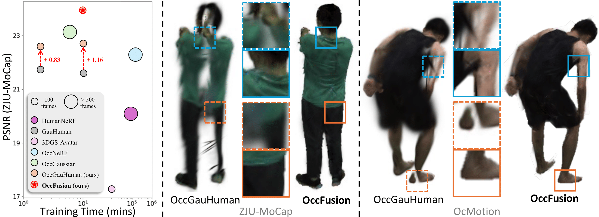

<div align="center">

<h1>OccFusion: Rendering Occluded Humans with Generative Diffusion Priors</h1>

<div>
    <a href="https://adamsunn.github.io/" target="_blank">Adam Sun*</a>;
    <a href="https://ai.stanford.edu/~xtiange/" target="_blank">Tiange Xiang*</a>;
    <a href="https://profiles.stanford.edu/scott-delp" target="_blank">Scott Delp</a>;
    <a href="https://profiles.stanford.edu/fei-fei-li" target="_blank">Li Fei-Fei^</a>;
    <a href="https://profiles.stanford.edu/ehsan-adeli" target="_blank">Ehsan Adeli^</a>;
</div>
<div>
    * Equal contributions; Junior author listed first.
    <br>
    ^ Equal mentorship.  
    <br>
    Stanford University
</div>
<div>
    NeurIPS 2024
</div>

<div style="width: 70%; text-align: center; margin:auto;">
    <br>
    <em>OccFusion recovers occluded human from monocular videos with <strong>only 10mins training time</strong></em>
</div>

For more visual results, go checkout our <a href="https://cs.stanford.edu/~xtiange/projects/occfusion/" target="_blank">project page</a>.  
For details, please refer to our <a href="https://arxiv.org/pdf/2407.00316" target="_blank">paper</a>

## Environment
To start with, please clone our envrionment:

```bash
    conda env create -f environment.yml
```

## Citation  
<!-- --- -->

If you find this repo useful in your work or research, please cite:

```bibtex
@article{sun2024occfusion,
    title={OccFusion: Rendering Occluded Humans with Generative Diffusion Priors},
    author={Adam Sun and Tiange Xiang and Scott Delp and Li Fei-Fei and Ehsan Adeli},
    journal={arXiv},
    url={https://arxiv.org/abs/2407.00316}, 
    year={2024}
}
```
